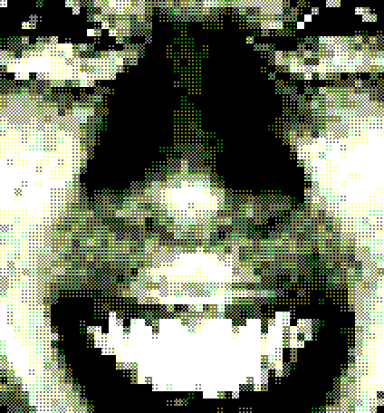

note: the code is ai slop. its usable, but more as a demo than anything. i wanted to see how hard it would be to make this, and i care more about the image output than the code so yea.

# AshDithEr




tool
make images pixelated and then dither them idk
you can do video as well but its kinda broken idk (for now)

this idea is from my brain. 
ok well i think i accidentally did this once and i thought it would be cool to have a tool that does it. 

send me a message if you make some cool images, videos or art work with this i wanna see.

thank you.

may or may not be updated, ill see.

## Features

- Dithers: floyd–steinberg, atkinson, burkes, sierra-3, bayer (2×2/4×4/8×8), and none
- Flexible pipeline stage: dither after downscale, after first x2, after second x2, or after final scale
- Dither scale: temporarily resize the image around dithering to control grain size
- Crisp nearest-neighbor scaling everywhere (down/up/resize)
- CLI for images, GUI for live-preview, and video helpers
- Optional Numba acceleration for error diffusion dithers (installed via requirements)

## Installation

```powershell
# From the repo root
python -m venv .venv
.\.venv\Scripts\Activate.ps1
pip install -r AshDithEr/../pixforge/requirements.txt

# Install ffmpeg (required for video encode/remux)
winget install --id=Gyan.FFmpeg -e
# or: choco install ffmpeg -y
```

Verify Python path for commands:
```powershell
C:\Users\asher\Documents\code\AshDith\.venv\Scripts\python.exe -V
```

## CLI (Images)

General usage:
```powershell
python -m AshDithEr.main -i "C:\in.png" -o "C:\out.png" --pixel 16 --colors 32 --dither bayer2 --dither-stage after-upscale2 --dither-scale 1 --scale 4
```

Arguments:
- `--pixel`: downscale factor (>=1)
- `--colors`: approximate total colors for quantization (>=2)
- `--dither`: `none|floyd|atkinson|burkes|sierra|bayer2|bayer4|bayer8`
- `--dither-stage`: `after-downscale|after-upscale1|after-upscale2|after-final`
- `--dither-scale`: temporary scale around the dithering step (e.g., 2 for coarser)
- `--scale`: final extra nearest-neighbor scale (>=1)

Quick examples (each method):
```powershell
# Floyd–Steinberg
python -m AshDithEr.main -i C:\in.png -o C:\out_floyd.png --pixel 16 --colors 32 --dither floyd --dither-stage after-upscale2 --scale 4

# Atkinson
python -m AshDithEr.main -i C:\in.png -o C:\out_atkinson.png --pixel 16 --colors 32 --dither atkinson --dither-stage after-upscale2 --scale 4

# Burkes
python -m AshDithEr.main -i C:\in.png -o C:\out_burkes.png --pixel 16 --colors 32 --dither burkes --dither-stage after-upscale2 --scale 4

# Sierra-3
python -m AshDithEr.main -i C:\in.png -o C:\out_sierra.png --pixel 16 --colors 32 --dither sierra --dither-stage after-upscale2 --scale 4

# Bayer ordered dithers (2x2 / 4x4 / 8x8)
python -m AshDithEr.main -i C:\in.png -o C:\out_bayer2.png --pixel 16 --colors 32 --dither bayer2 --dither-stage after-upscale2 --scale 4
python -m AshDithEr.main -i C:\in.png -o C:\out_bayer4.png --pixel 16 --colors 32 --dither bayer4 --dither-stage after-upscale2 --scale 4
python -m AshDithEr.main -i C:\in.png -o C:\out_bayer8.png --pixel 16 --colors 32 --dither bayer8 --dither-stage after-upscale2 --scale 4

# No dithering (uniform quantization only)
python -m AshDithEr.main -i C:\in.png -o C:\out_none.png --pixel 16 --colors 32 --dither none --dither-stage after-upscale2 --scale 4

# Control grain size (coarser dots)
python -m AshDithEr.main -i C:\in.png -o C:\out_bayer2_coarse.png --pixel 16 --colors 32 --dither bayer2 --dither-stage after-upscale2 --dither-scale 2 --scale 4
```

## GUI (Live Preview)

Launch the simple Tkinter UI:
```powershell
python -m AshDithEr.ui
```
- Load an image, tweak pixel size, colors, dither method/stage, and dither scale
- Preview renders at reduced size for speed; Save writes full resolution

## Video Pipelines

### Direct MP4 → MP4 (recommended)

Process a video in-place, then remux source audio if present:
```powershell
python -m AshDithEr.video_to_video --input "C:\in.mp4" --output "C:\out.mp4" `
  --pixel 16 --colors 32 --dither bayer2 --dither-stage after-upscale2 `
  --dither-scale 1 --final-scale 4 --overwrite
```

### Video → PNG frames

```powershell
python -m AshDithEr.video_frames -i "C:\in.mp4" -o "C:\frames" `
  --pixel 16 --colors 32 --dither bayer2 --dither-stage after-upscale2 `
  --dither-scale 1 --scale 4
```

### PNG frames → MP4

Full control stitcher:
```powershell
python -m AshDithEr.pngs_to_video -f "C:\frames" -o "C:\out.mp4" --fps 30 --overwrite
python -m AshDithEr.pngs_to_video -f "C:\frames" -o "C:\out.mp4" --fps 30 --audio-src "C:\in.mp4" --overwrite
```

Ultra-simple stitcher (auto FPS from source, audio remux if provided):
```powershell
python -m AshDithEr.stitch -f "C:\frames" --source "C:\in.mp4" --overwrite
python -m AshDithEr.stitch -f "C:\frames" --overwrite
```

Note: All video tools require `ffmpeg` on PATH.

## Programmatic API Examples

All operations use NumPy arrays (`uint8`, RGB). These helpers are importable.

### Load/Save
```python
from AshDithEr import load_image, save_image

arr = load_image(r"C:\in.png")  # (H, W, 3), uint8
save_image(arr, r"C:\copy.png")
```

### Downscale (nearest decimation), Pixelate, and Upscale
```python
import numpy as np
from AshDithEr import downscale_block_average, pixelate, upscale_nearest

small = downscale_block_average(arr, factor=16)  # nearest-style crisp downscale
pix   = pixelate(arr, factor=16)                 # block-average + nearest up
up2   = upscale_nearest(small, factor=2)
```

### Arbitrary nearest resize (float scale or size)
```python
from AshDithEr import resize_nearest, resize_nearest_scale

res1 = resize_nearest(arr, new_h=720, new_w=1280)
res2 = resize_nearest_scale(arr, scale=4.0)      # 4x nearest
```

### Dithering (all methods)
```python
from AshDithEr import apply_dither

# Approximate total colors. Per-channel levels L are chosen so L^3≈num_colors.
out_none   = apply_dither(arr, num_colors=32, method="none")
out_floyd  = apply_dither(arr, num_colors=32, method="floyd")
out_atk    = apply_dither(arr, num_colors=32, method="atkinson")
out_burkes = apply_dither(arr, num_colors=32, method="burkes")
out_sierra = apply_dither(arr, num_colors=32, method="sierra")
out_b2     = apply_dither(arr, num_colors=32, method="bayer2")
out_b4     = apply_dither(arr, num_colors=32, method="bayer4")
out_b8     = apply_dither(arr, num_colors=32, method="bayer8")
```

### Full pipeline (replicates CLI logic)
```python
from pixforge.utils.pixelate import downscale_block_average
from pixforge.utils.upscale import upscale_nearest
from pixforge.utils.resize import resize_nearest_scale
from pixforge.dithers import apply_dither

def pipeline(arr, pixel=16, colors=32, method="bayer2", stage="after-upscale2", dither_scale=1.0, final_scale=4):
	img_ds = downscale_block_average(arr, pixel) if pixel > 1 else arr.copy()
	img_up1 = upscale_nearest(img_ds, 2)
	img_up2 = upscale_nearest(img_up1, 2)
	img_final_pre = upscale_nearest(img_up2, final_scale) if final_scale > 1 else img_up2

	def apply_on(base):
		if dither_scale != 1.0:
			tmp = resize_nearest_scale(base, dither_scale)
			tmp = apply_dither(tmp, num_colors=colors, method=method)
			return resize_nearest_scale(tmp, 1.0 / dither_scale)
		return apply_dither(base, num_colors=colors, method=method)

	if method == "none":
		return img_up1 if stage == "after-upscale1" else (img_up2 if stage == "after-upscale2" else (img_ds if stage == "after-downscale" else img_final_pre))
	if stage == "after-downscale":
		work = apply_on(img_ds)
		work = upscale_nearest(work, 2)
		work = upscale_nearest(work, 2)
		return upscale_nearest(work, final_scale) if final_scale > 1 else work
	if stage == "after-upscale1":
		work = apply_on(img_up1)
		work = upscale_nearest(work, 2)
		return upscale_nearest(work, final_scale) if final_scale > 1 else work
	if stage == "after-upscale2":
		work = apply_on(img_up2)
		return upscale_nearest(work, final_scale) if final_scale > 1 else work
	# after-final
	return apply_on(img_final_pre)
```

## Tips

- For “chunkier” grain, use `--dither-scale 2` (or higher). For finer grain, try `0.5`.
- Bayer patterns are fast and stable; error diffusion (Floyd/Atkinson/Burkes/Sierra) yields organic noise but may be slower.
- Video encode needs `ffmpeg` on PATH. If not installed system-wide, download a static build and add the `bin` folder to PATH.

## License

This repository is provided as-is for personal/educational use.

